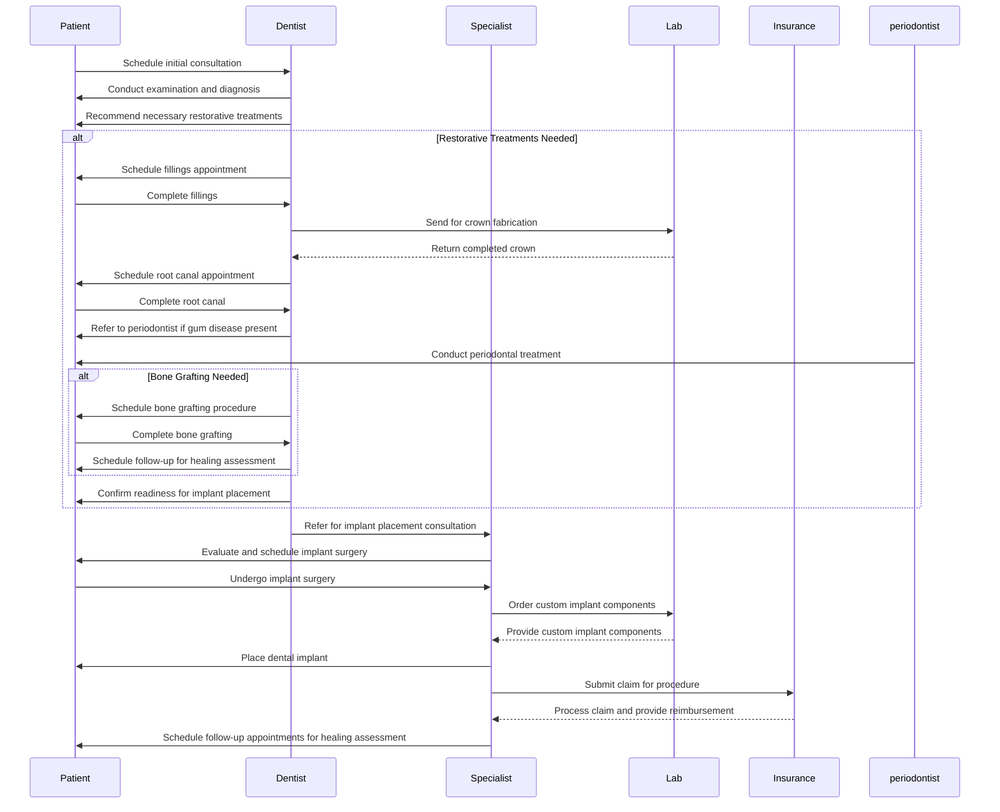
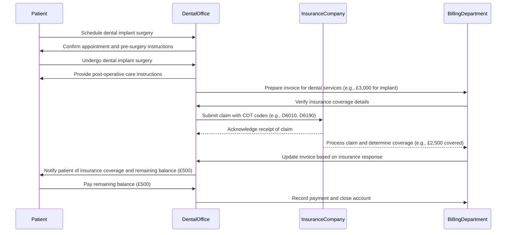

# Dentistry

## Flow

- **Healing Before Implants**: A patient must complete any necessary restorative treatments (e.g., fillings or root canals) on a tooth before being considered for a dental implant in that area to ensure the implant has a healthy foundation.
  - Fillings
  - Root Canals
  - Crown Placement
  - Periodontal Treatment
  - Bone Grafting
  - Extraction of Compromised Teeth
  - Scaling and Root Planing
  - Sinus Lift (if needed)
  - Treatment for Gum Disease
  - Orthodontic Treatment (if misalignment affects implant placement)

### Explanation of the Flow

1. **Initial Consultation**: The patient schedules an initial consultation with the dentist.
2. **Diagnosis**: The dentist conducts an examination and recommends necessary restorative treatments.
3. **Restorative Treatments**:
   - Fillings and crowns are addressed first.
   - Root canals are performed if needed.
   - Periodontal treatment is referred if gum disease is present.
   - Bone grafting is scheduled if required.
4. **Implant Placement**:
   - The dentist refers the patient to a specialist for implant placement.
   - The specialist evaluates the patient and schedules the surgery.
5. **Surgery**: The patient undergoes the implant surgery, after which custom components are ordered from the lab.
6. **Insurance Processing**: Claims are submitted to insurance for reimbursement.
7. **Follow-Up**: Follow-up appointments are scheduled to monitor healing.

### Billing and Insurance Claim after a dental implant surgery.

- **Scheduling**: The patient schedules the dental implant surgery with the dental office.
- **Surgery**: The patient undergoes the procedure and receives post-operative care instructions.
- **Invoice Preparation**: The dental office prepares an invoice for the services rendered.
- **Insurance Verification**: The billing department verifies the patient's insurance coverage.
- **Claim Submission**: A claim is submitted to the insurance company with appropriate CDT codes.
- **Claim Processing**: The insurance company processes the claim and determines the covered amount.
- **Invoice Update**: The billing department updates the invoice based on the insurance response.
- **Patient Notification**: The patient is notified of their financial responsibility after insurance coverage.
- **Payment Collection**: The patient pays the remaining balance, and the billing department records this payment.

## Pricing

### Dental Implant Pricing Plan

#### Full Process Pricing
- **Complete Dental Implant Package**: £3,500 - £20,000
  - Includes:
    - Initial consultation
    - Necessary restorative treatments (fillings, root canals, etc.)
    - Dental implant placement (root and abutment)
    - Crown placement (ceramic or zirconia)
    - Follow-up appointments

#### Individual Service Pricing
1. **Initial Consultation**: £100 - £200
2. **Restorative Treatments**:
   - Fillings: £150 - £300 per tooth
   - Root Canals: £800 - £1,500 per tooth
   - Crowns: £1,000 - £2,500 per crown
   - Periodontal Treatment: £300 - £600
   - Bone Grafting: £400 - £1,200
3. **Dental Implants**:
   - Single Implant (root + abutment): £2,000 - £4,000
   - Crown for Implant: £1,000 - £2,500
4. **Follow-Up Appointments**: £50 - £150 per visit

#### Promotional Packages
- **Anesthesia Package**: Pay for 2 sessions, get 1 free!
  - Price: £600 for 3 sessions (regular price: £900)
  
- **Restorative Treatment Bundle**: 
  - Get fillings and root canal treatment at a discounted rate.
  - Price: £1,200 for one filling and one root canal (regular price: £1,500)

- **Implant Package Deal**:
  - Receive a discount when getting multiple implants.
  - Price: £7,000 for 4 implants (regular price: £8,000)

- **Full Mouth Restoration Package**:
  - All-on-4 or All-on-6 implants with temporary teeth included.
  - Price: Starting from £12,000 (includes consultation and follow-up visits)

#### Additional Notes:
- All prices are estimates and may vary based on individual needs and clinic location.
- Insurance coverage may apply; check with your provider for specifics on reimbursement.
- Flexible payment plans are available to accommodate different financial situations.

### Specialists Involved in the Dental Implant Process
- **General Dentist**
- **Oral Surgeon**
- **Maxillofacial Surgeon**
- **Periodontist**
- **Prosthodontist**

### Information Required by Each Specialist
1. **General Dentist**
   - Patient's medical history
   - Dental history and treatment records
   - Initial examination findings
   - Referral details for specialists

2. **Oral Surgeon / Maxillofacial Surgeon**
   - Detailed medical history (including medications and allergies)
   - Imaging results (e.g., X-rays, CT scans)
   - Bone density assessments
   - Surgical consent forms

3. **Periodontist**
   - Gum health status and periodontal examination results
   - Treatment plans for any existing gum disease
   - Healing progress notes from previous treatments

4. **Prosthodontist**
   - Specifications for crown design (shade, material)
   - Impressions of the dental arch
   - Final treatment plan including timing of crown placement

### Types of Documents Stored Within the Digital System
- **Patient Records**:
  - Personal identification information
  - Medical history and allergy records
  - Dental history and treatment logs

- **Imaging Documents**:
  - Panoramic radiographs (pantomograms)
  - Cone beam computed tomography (CBCT) scans
  - Standard X-rays

- **Treatment Plans**:
  - Detailed treatment plans for restorative procedures
  - Surgical plans for implant placement

- **Consent Forms**:
  - Informed consent forms for surgical procedures
  - Consent for anesthesia administration

- **Clinical Notes**:
  - Examination notes from consultations
  - Progress notes during treatment phases

- **Laboratory Documents**:
  - Crown specifications and fabrication instructions
  - Laboratory reports on materials used

- **Billing and Insurance Information**:
  - Estimates for procedures and services rendered
  - Insurance claim submissions and payment records

# Wardley Map for Dental Clinic Network

## User Needs
- **Access to Dental Care**
- **Quality Treatment**
- **Convenient Appointments**
- **Affordable Pricing**
- **Patient Education**

## Map Components

### 1. User Needs
- **Patients**: Need access to affordable and quality dental care.
- **Insurance Providers**: Require efficient claims processing and patient management.
- **Dental Professionals**: Seek opportunities for professional development and collaboration.

### 2. Activities (Current State)
- **In-Person Consultations**: Traditional face-to-face appointments.
- **Treatment Services**: General dentistry, orthodontics, cosmetic procedures.
- **Insurance Claims Processing**: Manual submission and tracking of insurance claims.
- **Patient Records Management**: Paper-based or basic digital systems for record keeping.

### 3. Evolving Activities (Future Opportunities)
- **Tele-dentistry**: Virtual consultations and follow-ups to increase accessibility.
- **Integrated Practice Management Software**: Streamlined operations for scheduling, billing, and patient management.
- **Patient Education Platforms**: Online resources and tools for patient education on oral health.
- **Mobile Apps**: Patient portals for appointment booking, reminders, and accessing records.

### 4. Evolution Stages
- **Genesis**: Development of tele-dentistry services.
- **Custom-Built**: Implementation of integrated practice management systems tailored to the clinic's needs.
- **Product (Rental)**: Adoption of commercial patient education platforms.
- **Commodity (Utility)**: Standardization of billing processes through automated insurance claims management.

---

## Future Opportunities
1. **Expanding Tele-dentistry Services**: To reach underserved areas and improve access to care.
2. **Partnerships with Insurance Providers**: For better reimbursement rates and streamlined claims processing.
3. **Community Outreach Programs**: To enhance brand visibility and educate the public on oral health.
