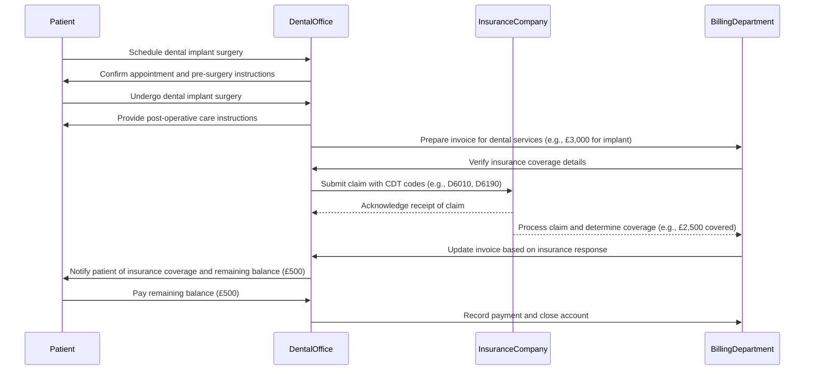

# Dental Implant Surgery

## Billing and Insurance Claim after a dental implant surgery.

- **Scheduling**: The patient schedules the dental implant surgery with the dental office.
- **Surgery**: The patient undergoes the procedure and receives post-operative care instructions.
- **Invoice Preparation**: The dental office prepares an invoice for the services rendered.
- **Insurance Verification**: The billing department verifies the patient's insurance coverage.
- **Claim Submission**: A claim is submitted to the insurance company with appropriate CDT codes.
- **Claim Processing**: The insurance company processes the claim and determines the covered amount.
- **Invoice Update**: The billing department updates the invoice based on the insurance response.
- **Patient Notification**: The patient is notified of their financial responsibility after insurance coverage.
- **Payment Collection**: The patient pays the remaining balance, and the billing department records this payment.

----

## Dental Implant Pricing Plan

### Full Process Pricing
- **Complete Dental Implant Package**: £3,500 - £20,000
  - Includes:
    - Initial consultation
    - Necessary restorative treatments (fillings, root canals, etc.)
    - Dental implant placement (root and abutment)
    - Crown placement (ceramic or zirconia)
    - Follow-up appointments

### Individual Service Pricing
1. **Initial Consultation**: £100 - £200
2. **Restorative Treatments**:
   - Fillings: £150 - £300 per tooth
   - Root Canals: £800 - £1,500 per tooth
   - Crowns: £1,000 - £2,500 per crown
   - Periodontal Treatment: £300 - £600
   - Bone Grafting: £400 - £1,200
3. **Dental Implants**:
   - Single Implant (root + abutment): £2,000 - £4,000
   - Crown for Implant: £1,000 - £2,500
4. **Follow-Up Appointments**: £50 - £150 per visit

### Promotional Packages
- **Anesthesia Package**: Pay for 2 sessions, get 1 free!
  - Price: £600 for 3 sessions (regular price: £900)
  
- **Restorative Treatment Bundle**: 
  - Get fillings and root canal treatment at a discounted rate.
  - Price: £1,200 for one filling and one root canal (regular price: £1,500)

- **Implant Package Deal**:
  - Receive a discount when getting multiple implants.
  - Price: £7,000 for 4 implants (regular price: £8,000)

- **Full Mouth Restoration Package**:
  - All-on-4 or All-on-6 implants with temporary teeth included.
  - Price: Starting from £12,000 (includes consultation and follow-up visits)

### Additional Notes:
- All prices are estimates and may vary based on individual needs and clinic location.
- Insurance coverage may apply; check with your provider for specifics on reimbursement.
- Flexible payment plans are available to accommodate different financial situations.
