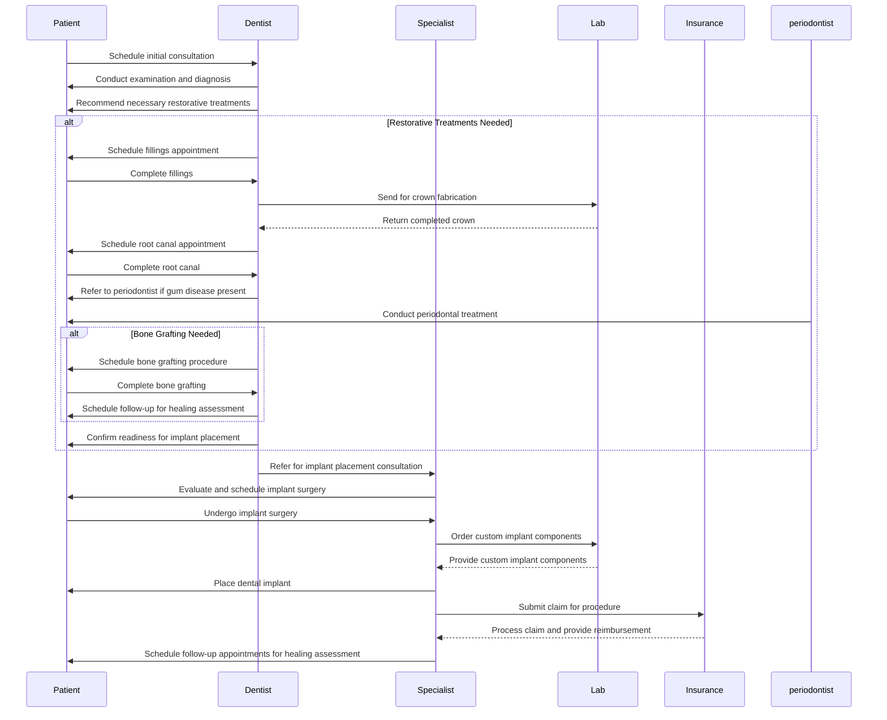

# Dental Implant Surgery

## Flow

- **Healing Before Implants**: A patient must complete any necessary restorative treatments (e.g., fillings or root canals) on a tooth before being considered for a dental implant in that area to ensure the implant has a healthy foundation.
  - Fillings
  - Root Canals
  - Crown Placement
  - Periodontal Treatment
  - Bone Grafting
  - Extraction of Compromised Teeth
  - Scaling and Root Planing
  - Sinus Lift (if needed)
  - Treatment for Gum Disease
  - Orthodontic Treatment (if misalignment affects implant placement)

### Explanation of the Flow

1. **Initial Consultation**: The patient schedules an initial consultation with the dentist.
2. **Diagnosis**: The dentist conducts an examination and recommends necessary restorative treatments.
3. **Restorative Treatments**:
   - Fillings and crowns are addressed first.
   - Root canals are performed if needed.
   - Periodontal treatment is referred if gum disease is present.
   - Bone grafting is scheduled if required.
4. **Implant Placement**:
   - The dentist refers the patient to a specialist for implant placement.
   - The specialist evaluates the patient and schedules the surgery.
5. **Surgery**: The patient undergoes the implant surgery, after which custom components are ordered from the lab.
6. **Insurance Processing**: Claims are submitted to insurance for reimbursement.
7. **Follow-Up**: Follow-up appointments are scheduled to monitor healing.
