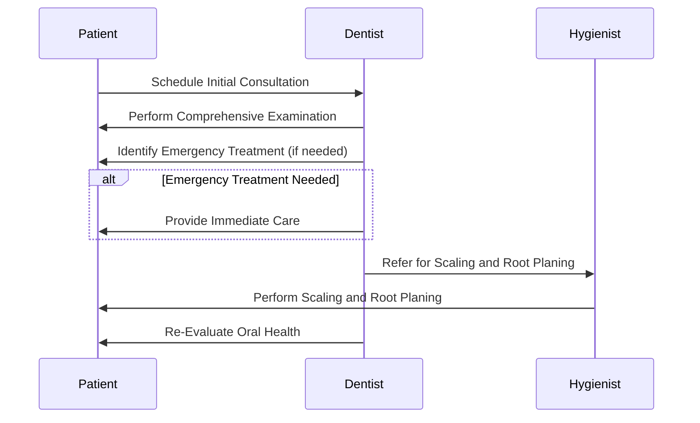
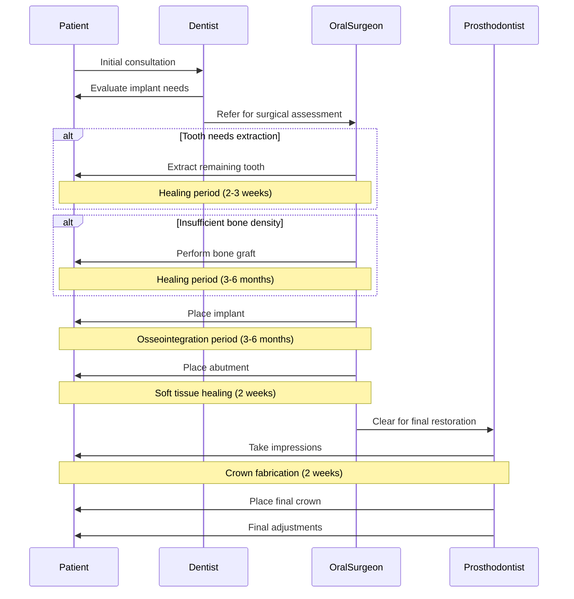
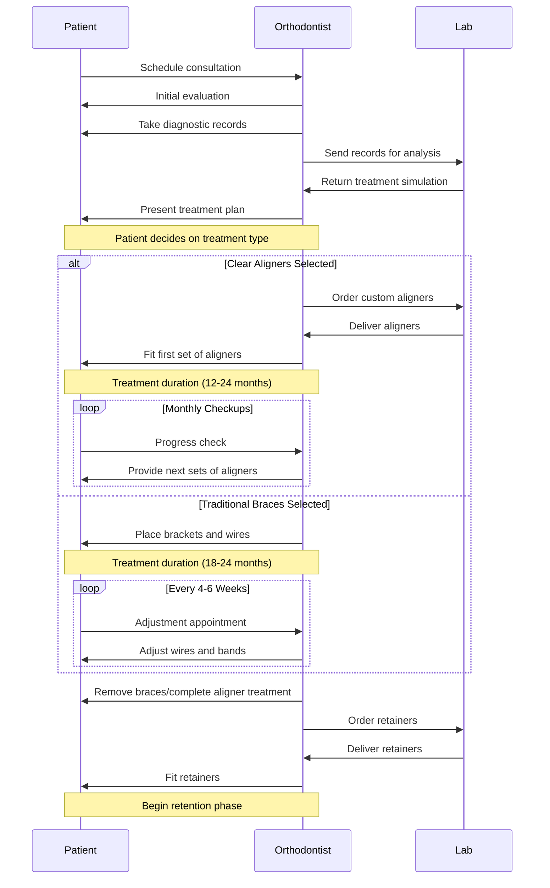
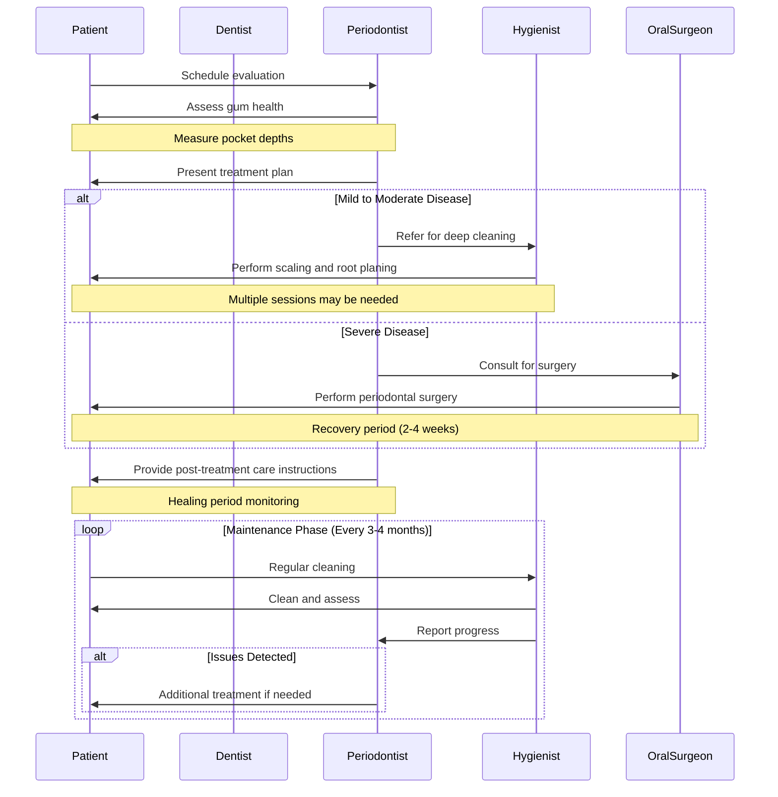
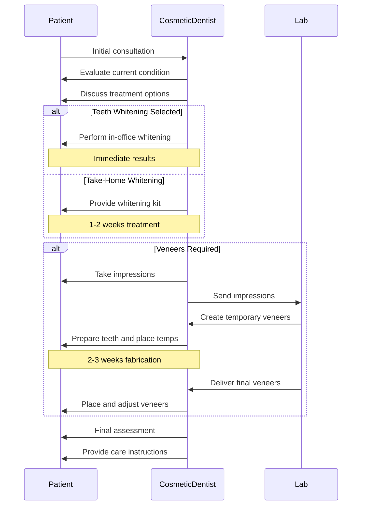
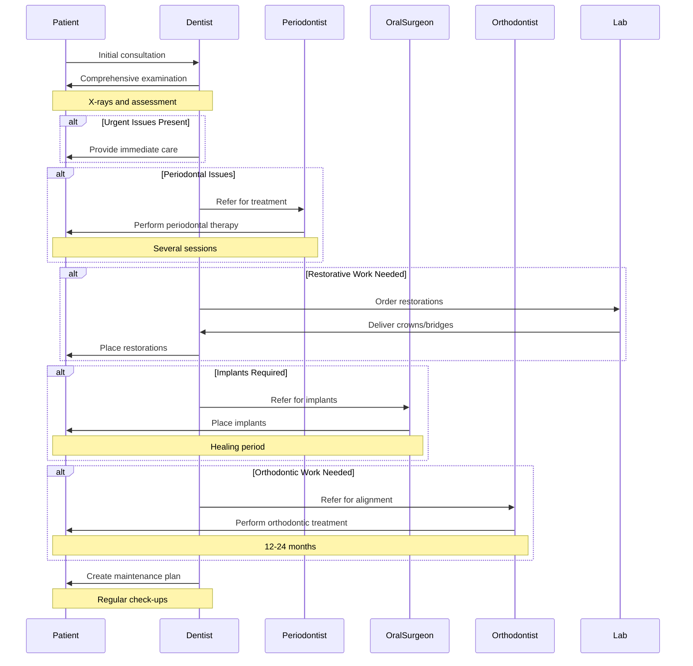
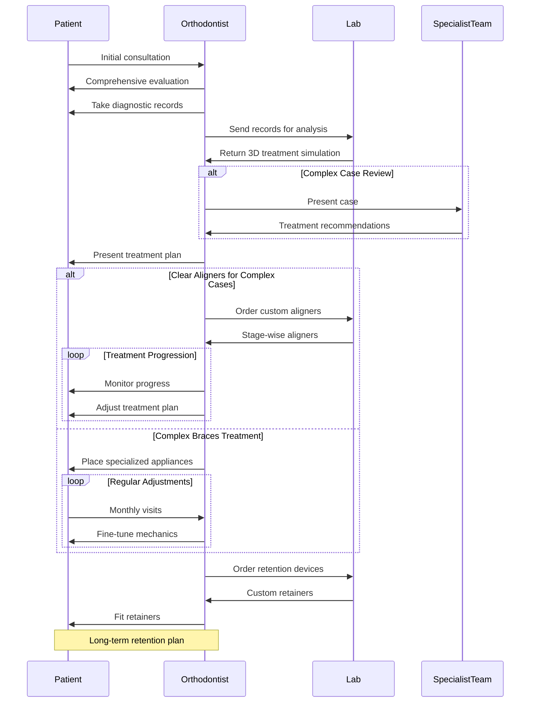
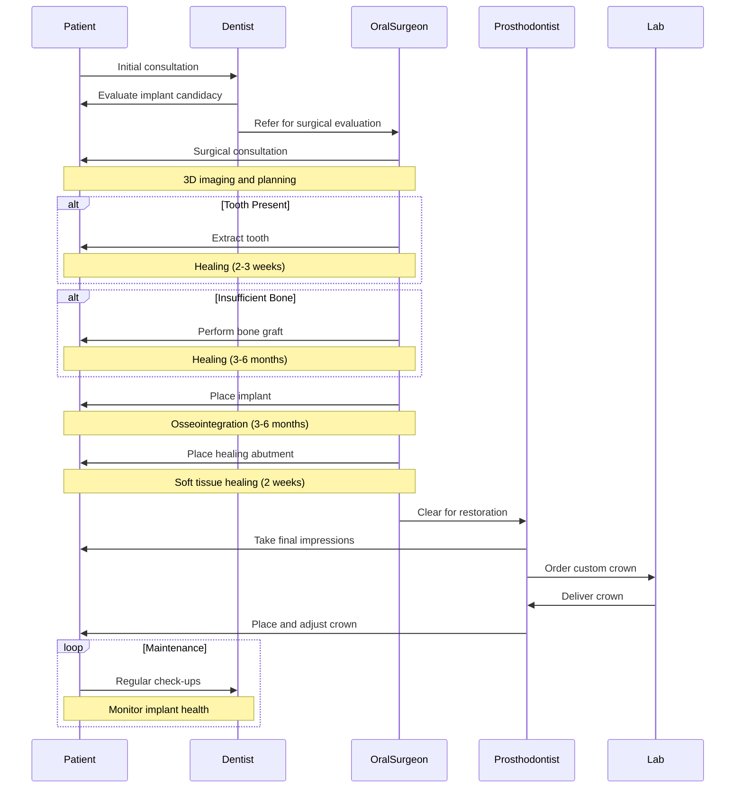

# Dental Procedures and Consultations

ToC:

- List of Dental Procedures and Consultations
- Price Range, Time Estimates, and Specialists for Dental Procedures
- Multi-Step Dental Treatment Sequences

## List of Dental Procedures and Consultations

### 1. General Dental Examination
- A comprehensive assessment of oral health, including teeth, gums, and soft tissues.

### 2. Tooth Extraction
- The removal of a tooth due to decay, damage, or other dental issues.

### 3. Root Canal Treatment (Endodontics)
- A procedure to treat infection or damage in the tooth's pulp, preserving the tooth.

### 4. Orthodontic Consultation
- An evaluation to determine the need for braces or other orthodontic treatments.

### 5. Periodontal Treatment
- Treatment for gum disease, including scaling and root planing to clean infected areas.

### 6. Dental Cleaning (Prophylaxis)
- A routine cleaning to remove plaque and tartar buildup from teeth.

### 7. Dental Fillings
- The process of restoring a tooth damaged by decay using materials like composite or amalgam.

### 8. Crowns and Bridges
- Restorative procedures to replace missing teeth or cover damaged ones.

### 9. Dentures
- Removable appliances used to replace missing teeth and restore function and aesthetics.

### 10. Cosmetic Dentistry
- Procedures aimed at improving the appearance of teeth, gums, and smiles (e.g., whitening, veneers).

### 11. Surgical Procedures
- Includes wisdom tooth extraction, apicoectomy (root-end surgery), and other surgical interventions.

### 12. Pediatric Dentistry
- Specialized care for children's dental needs, including preventive treatments and early intervention.

### 13. Oral Cancer Screening
- An examination to detect signs of oral cancer or precancerous conditions.

### 14. Dental Implants
- Surgical placement of artificial tooth roots to support crowns or dentures.

### 15. Teeth Whitening
- Cosmetic procedure to lighten the color of teeth using bleaching agents.

### 16. Fluoride Treatments
- Application of fluoride to strengthen teeth and prevent decay.

### 17. Sealants
- Protective coatings applied to the chewing surfaces of back teeth to prevent cavities.

### 18. Temporomandibular Joint (TMJ) Treatment
- Management of jaw pain and dysfunction related to TMJ disorders.

### 19. Emergency Dental Care
- Immediate treatment for dental emergencies such as severe pain, trauma, or infections.

### 20. Consultation for Dental Anxiety
- Evaluation and management strategies for patients with fear or anxiety related to dental visits.

### 21. Sinus Lift
- A surgical procedure to add bone to the upper jaw in preparation for dental implants.

### 22. Bone Grafting
- The process of adding bone material to the jaw to support dental implants or restore lost bone structure.

### 23. Periodontal Maintenance
- Ongoing care for patients with a history of gum disease, involving regular cleanings and evaluations.

### 24. Oral Surgery
- Surgical procedures performed in the mouth, such as biopsies or treatment of jaw fractures.

### 25. Custom Mouthguards
- Personalized protective devices designed to prevent injury during sports or to manage teeth grinding (bruxism).

### 26. Dental Consultation for Sleep Apnea
- Evaluation and treatment options for patients suffering from sleep apnea, including oral appliances.

### 27. Geriatric Dentistry
- Specialized dental care addressing the unique needs of elderly patients, focusing on maintaining oral health.

### 28. Nutritional Counseling
- Guidance on dietary choices that promote oral health and prevent dental diseases.

### 29. Dental Photography
- Professional imaging used for treatment planning, documentation, and patient education.

### 30. Sedation Dentistry
- Use of sedatives to help patients relax during dental procedures, particularly those with anxiety.

### 31. Intraoral Scanning
- A digital method for capturing detailed images of the mouth for diagnostics and treatment planning.

### 32. Digital Smile Design
- A cosmetic procedure using digital technology to visualize potential smile enhancements before treatment.

### 33. Tooth Sensitivity Treatments
- Procedures aimed at reducing discomfort from sensitive teeth, often involving desensitizing agents.

### 34. Reconstructive Dentistry
- Comprehensive restoration of damaged or missing teeth using various techniques, including implants and prosthetics.

### 35. Pulp Vitality Testing
- Diagnostic tests to assess the health of the tooth pulp and determine the need for further treatment.

### 36. Oral Hygiene Instruction
- Education provided to patients on effective brushing, flossing, and overall oral care practices.

### 37. Management of Oral Lesions
- Diagnosis and treatment of various oral lesions, including ulcers, cysts, and other abnormalities.

### 38. Salivary Testing
- Analysis of saliva to assess oral health conditions or risk factors for dental diseases.

### 39. TMJ Splint Therapy
- Use of custom-made splints to alleviate pain and dysfunction associated with temporomandibular joint disorders.

### 40. Emergency Root Canal Treatment
- Immediate endodontic care for infected or abscessed teeth requiring urgent attention.

### 41. Oral Health Risk Assessment
- A comprehensive evaluation to identify factors that may contribute to dental diseases and inform preventive strategies.

### 42. Custom Dental Appliances
- Fabrication of specialized devices, such as retainers or night guards, tailored to individual patient needs.

### 43. Cleft Lip and Palate Treatment
- Comprehensive dental care for patients with congenital conditions affecting the lip and palate, often involving multidisciplinary teams.

### 44. Management of Halitosis
- Evaluation and treatment of chronic bad breath, including identifying underlying causes and providing solutions.

### 45. Non-Surgical Gum Therapy
- Minimally invasive treatments aimed at reducing gum inflammation and promoting healing without surgery.

### 46. Dental Tourism Consultation
- Guidance for patients seeking dental care abroad, including information on procedures, costs, and travel arrangements.

### 47. Oral Appliance Therapy for Sleep Disorders
- Fitting and management of oral devices designed to treat snoring and obstructive sleep apnea.

### 48. Advanced Imaging Techniques
- Use of technologies such as Cone Beam Computed Tomography (CBCT) for detailed imaging of dental structures.

### 49. Pediatric Preventive Care
- Services focused on preventing dental issues in children, including fluoride treatments and sealants.

### 50. Cosmetic Gum Surgery
- Procedures aimed at reshaping or repositioning gums to enhance the aesthetics of the smile.

### 51. Biopsy of Oral Lesions
- Surgical removal of tissue samples from suspicious areas in the mouth for laboratory analysis.

### 52. Suture Removal
- Follow-up procedure to remove stitches after oral surgery or other dental procedures.

### 53. Management of Oral Complications from Cancer Treatment
- Specialized care addressing dental issues arising from chemotherapy or radiation therapy.

### 54. Treatment for Oral Manifestations of Systemic Diseases
- Dental care focused on addressing oral health problems related to systemic conditions like diabetes or autoimmune disorders.

### 55. Consultation for Dental Implants
- Assessment and planning for implant placement, including evaluation of bone density and overall oral health.

### 56. Preventive Care for High-Risk Patients
- Tailored preventive strategies for individuals with increased risk of dental diseases, such as those with a history of periodontal disease.

### 57. Digital Impressions
- Use of digital technology to create precise impressions of teeth for crowns, bridges, or aligners without traditional molds.

### 58. Interceptive Orthodontics
- Early orthodontic intervention aimed at correcting developing bite issues in children before they become more severe.

### 59. Treatment Planning for Complex Cases
- Comprehensive evaluation and strategy development for patients with multiple dental issues requiring coordinated care.

### 60. Community Outreach Programs
- Initiatives aimed at promoting oral health awareness and providing dental services to underserved populations.

----

The following procedures and consultations do not typically fit into a standard patient appointment due to their complexity, duration, or requirement for specialized care:

1. **Sinus Lift**  
   - A surgical procedure that requires significant preparation and recovery time, usually not performed in a typical appointment.

2. **Bone Grafting**  
   - Involves surgical intervention to add bone material, often necessitating multiple visits for planning and healing.

3. **Oral Surgery**  
   - Complex surgical procedures such as biopsies or jaw fracture treatments typically require separate appointments for assessment and surgery.

4. **Dental Consultation for Sleep Apnea**  
   - Involves a detailed evaluation and treatment planning that extends beyond a single visit.

5. **Geriatric Dentistry**  
   - Specialized care for elderly patients may require extensive assessments and follow-up visits.

6. **Nutritional Counseling**  
   - This involves detailed discussions about dietary habits and oral health, usually requiring a dedicated session.

7. **Dental Photography**  
   - While important for documentation, this is often done separately from treatment appointments.

8. **Sedation Dentistry**  
   - Procedures involving sedation may require additional pre-appointment evaluations and monitoring during recovery.

9. **Advanced Imaging Techniques**  
   - Procedures like Cone Beam CT scans usually necessitate separate appointments for imaging and consultation.

10. **Community Outreach Programs**  
    - These initiatives are generally organized events rather than individual patient appointments.

11. **Management of Oral Complications from Cancer Treatment**  
    - Often requires a multidisciplinary approach and multiple visits for comprehensive care.

12. **Cleft Lip and Palate Treatment**  
    - Involves a coordinated effort among various specialists over multiple appointments.

13. **Biopsy of Oral Lesions**  
    - Typically requires a separate appointment for the procedure and subsequent follow-up for results.

14. **Suture Removal**  
    - While it is a follow-up procedure, it is often scheduled separately from the initial surgical appointment.

15. **Treatment Planning for Complex Cases**  
    - Requires thorough evaluations and discussions that extend beyond a single visit.

These procedures generally involve more extensive planning, specialized skills, or follow-up care that cannot be accommodated within the timeframe of a typical dental appointment.

----

## Price Range, Time Estimates, and Specialists for Dental Procedures

| Procedure/Consultation                              | Price Range (GBP)      | Estimated Time (Minutes) | Specialist(s)                         |
|-----------------------------------------------------|-------------------------|---------------------------|---------------------------------------|
| 1. General Dental Examination                        | £40 - £75               | 30                        | Dentist                               |
| 2. Tooth Extraction                                  | £80 - £400              | 30 - 60                   | Dentist, Oral Surgeon                 |
| 3. Root Canal Treatment (Endodontics)               | £300 - £800             | 60 - 90                   | Endodontist, Dentist                  |
| 4. Orthodontic Consultation                          | £35 - £100              | 30                        | Orthodontist                          |
| 5. Periodontal Treatment                             | £100 - £1,575           | 30 - 90                   | Periodontist, Dentist                 |
| 6. Dental Cleaning (Prophylaxis)                    | £60 - £120              | 30 - 60                   | Dentist, Hygienist                    |
| 7. Dental Fillings                                   | £110 - £250             | 30                        | Dentist                               |
| 8. Crowns and Bridges                               | £450 - £900             | 60 - 120                  | Dentist, Prosthodontist               |
| 9. Dentures                                         | £400 - £2,500           | 60 - 120                  | Prosthodontist, Dentist               |
| 10. Cosmetic Dentistry                               | £190 - £1,000           | 30 - 120                  | Cosmetic Dentist, Dentist             |
| 11. Surgical Procedures                              | £210 - £1,500           | 30 - 120                  | Oral Surgeon, Dentist                 |
| 12. Pediatric Dentistry                              | £35 - £150              | 30                        | Pediatric Dentist                     |
| 13. Oral Cancer Screening                            | £50 - £150              | 30                        | Dentist                               |
| 14. Dental Implants                                  | £700 - £3,000           | 60 - 120                  | Oral Surgeon, Implantologist          |
| 15. Teeth Whitening                                  | £190 - £500             | 30                        | Dentist                               |
| 16. Fluoride Treatments                              | £20 - £50               | 15                        | Dentist, Hygienist                    |
| 17. Sealants                                        | £30 - £50               | 15                        | Dentist                               |
| 18. Temporomandibular Joint (TMJ) Treatment        | £150 - £500             | 30                        | Dentist, Oral Surgeon                 |
| 19. Emergency Dental Care                            | £80 - £600              | Varies                    | Dentist                               |
| 20. Consultation for Dental Anxiety                  | £35 - £100              | 30                        | Dentist                               |
| 21. Sinus Lift                                      | £600 - £1,250           | 60 - 90                   | Oral Surgeon                          |
| 22. Bone Grafting                                    | £400 - £1,000           | 60 - 120                  | Oral Surgeon                          |
| 23. Periodontal Maintenance                          | £100 - £300             | Varies                    | Periodontist                          |
| 24. Oral Surgery                                     | £300 - £1,500           | Varies                    | Oral Surgeon                          |
| 25. Custom Mouthguards                               | £100 - £300             | 30                        | Dentist                               |
| 26. Dental Consultation for Sleep Apnea              | £35 - £100              | 30                        | Dentist                               |
| 27. Geriatric Dentistry                              | £40 - £150              | Varies                    | Geriatric Dentist                     |
| 28. Nutritional Counseling                           | £35 - £100              | Varies                    | Dentist                               |
| 29. Dental Photography                               | Free –£100              | Varies                    | Dentist                               |
| 30. Sedation Dentistry                               | From £250               | Varies                    | Dentist                               |
| 31. Intraoral Scanning                              | From £50                | Varies                    | Dentist                               |
| 32. Digital Smile Design                             | From £200               | Varies                    | Cosmetic Dentist                       |
| 33. Tooth Sensitivity Treatments                     | From £50                | Varies                    | Dentist                               |
| 34. Reconstructive Dentistry                         |-From£600                |-Varies                     |-Oral Surgeon,Dentist                  |
|35 . Pulp Vitality Testing                            |-From£50                 |-Varies                     |-Dentist                                |
|36 . Oral Hygiene Instruction                         |-Free –£50              |-Varies                     |-Hygienist,Dentist                     |
|37 . Management of Oral Lesions                       |-From£100                |-Varies                     |-Oral Surgeon,Dentist                   |
|38 . Salivary Testing                                 |-From£50                 |-Varies                     |-Dentist                                |
| 39. TMJ Splint Therapy                              | From £150               | Varies                    | Dentist, Oral Surgeon                 |
| 40. Emergency Root Canal Treatment                   | From £300               | Varies                    | Endodontist, Dentist                  |
| 41. Oral Health Risk Assessment                      | From £50                | Varies                    | Dentist                               |
| 42. Custom Dental Appliances                         | From £100               | Varies                    | Dentist, Orthodontist                 |
| 43. Cleft Lip and Palate Treatment                  | From £500               | Varies                    | Oral Surgeon, Pediatric Dentist        |
| 44. Management of Halitosis                          | From £50                | Varies                    | Dentist                               |
| 45. Non-Surgical Gum Therapy                         | From £200               | Varies                    | Periodontist, Dentist                 |
| 46. Dental Tourism Consultation                      | Free –£100              | N/A                       | Dentist                               |
| 47. Oral Appliance Therapy for Sleep Disorders       | From £200               | N/A                       | Dentist                               |
| 48. Advanced Imaging Techniques                      | From £70                | N/A                       | Dentist, Oral Surgeon                 |
| 49. Pediatric Preventive Care                        | £40 - £150              | Varies                    | Pediatric Dentist                     |
| 50. Cosmetic Gum Surgery                             | £150 - £700             | Varies                    | Periodontist, Cosmetic Dentist        |
| 51. Biopsy of Oral Lesions                           | From £100               | Varies                    | Oral Surgeon, Dentist                 |
| 52. Suture Removal                                   | From £50                | 15 - 30                   | Oral Surgeon, Dentist                 |
| 53. Management of Oral Complications from Cancer Treatment   | From £100         | Varies                    | Dentist, Oncologist                   |
| 54. Treatment for Oral Manifestations of Systemic Diseases   | From £100         | Varies                    | Dentist                               |
| 55. Consultation for Dental Implants                 | From £100               | 30 - 60                   | Oral Surgeon, Implantologist          |
| 56. Preventive Care for High-Risk Patients          | From £50                | Varies                    | Dentist                               |
| 57. Digital Impressions                              | From £50                | Varies                    | Dentist                               |
| 58. Interceptive Orthodontics                        | From £200               | Varies                    | Orthodontist                          |
| 59. Treatment Planning for Complex Cases             | From £100               | Varies                    | Dentist                               |
| 60. Community Outreach Programs                      |-Free –£100              |-N/A                        |-Dentist                                |

----

## Multi-Step Dental Treatment Sequences

### Sequence 1: Comprehensive Care for Dental Health
1. **Initial Consultation**
   - Comprehensive examination of oral health, including X-rays and patient history.
   - **Specialist(s)**: Dentist
2. **Emergency Treatment (if needed)**
   - Address any immediate pain or abscesses.
   - **Specialist(s)**: Dentist
3. **Scaling and Root Planing**
   - Initial periodontal treatment to remove plaque and tartar.
   - **Specialist(s)**: Dentist, Hygienist
4. **Caries Control**
   - Identify and treat any cavities.
   - **Specialist(s)**: Dentist
5. **Re-Evaluation**
   - Assess healing and improvement in oral health.
   - **Specialist(s)**: Dentist

### Sequence 2: Tooth Replacement with Implant
1. **Consultation for Missing Tooth**
   - Evaluate the need for an implant and discuss options.
   - **Specialist(s)**: Dentist, Oral Surgeon
2. **Tooth Extraction (if necessary)**
   - Remove any remaining tooth structure if applicable.
   - **Specialist(s)**: Dentist, Oral Surgeon
3. **Bone Grafting (if needed)**
   - Prepare the jawbone for implant placement if there is insufficient bone density.
   - **Specialist(s)**: Oral Surgeon
4. **Implant Placement**
   - Surgical placement of the dental implant into the jawbone.
   - **Specialist(s)**: Oral Surgeon, Implantologist
5. **Healing Period**
   - Allow time for osseointegration (integration of the implant with bone).
6. **Abutment Placement**
   - Attach an abutment to the implant for the final restoration.
   - **Specialist(s)**: Oral Surgeon, Implantologist
7. **Crown Placement**
   - Finalize with a custom crown on top of the abutment.
   - **Specialist(s)**: Dentist, Prosthodontist

### Sequence 3: Orthodontic Treatment
1. **Orthodontic Consultation**
   - Initial evaluation to determine the need for braces or aligners.
   - **Specialist(s)**: Orthodontist
2. **Diagnostic Records**
   - Take X-rays, photographs, and impressions of teeth.
   - **Specialist(s)**: Orthodontist
3. **Treatment Plan Development**
   - Create a detailed plan outlining the orthodontic approach.
   - **Specialist(s)**: Orthodontist
4. **Placement of Braces/Aligners**
   - Attach braces or provide clear aligners to begin treatment.
   - **Specialist(s)**: Orthodontist
5. **Regular Adjustments**
   - Schedule periodic visits for adjustments and monitoring progress.
   - **Specialist(s)**: Orthodontist
6. **Retention Phase**
   - After treatment completion, use retainers to maintain tooth position.
   - **Specialist(s)**: Orthodontist

### Sequence 4: Periodontal Treatment
1. **Initial Periodontal Evaluation**
   - Assess gum health and measure pocket depths to determine severity.
   - **Specialist(s)**: Periodontist, Dentist
2. **Scaling and Root Planing**
   - Deep cleaning to remove plaque and tartar from below the gum line.
   - **Specialist(s)**: Periodontist, Dentist, Hygienist
3. **Surgical Intervention (if necessary)**
   - Perform periodontal surgery if there are significant issues (e.g., flap surgery).
   - **Specialist(s)**: Periodontist, Oral Surgeon
4. **Post-Surgical Care**
   - Monitor healing and provide care instructions for recovery.
   - **Specialist(s)**: Periodontist, Dentist
5. **Maintenance Visits**
   - Schedule regular cleanings and evaluations to monitor gum health.
   - **Specialist(s)**: Periodontist, Hygienist

### Sequence 5: Aesthetic Enhancement
1. **Cosmetic Consultation**
   - Discuss aesthetic goals and evaluate current dental condition.
   - **Specialist(s)**: Cosmetic Dentist, Dentist
2. **Teeth Whitening Treatment**
   - Perform in-office whitening or provide take-home kits.
   - **Specialist(s)**: Cosmetic Dentist, Dentist
3. **Veneer Preparation (if applicable)**
   - Prepare teeth for veneers, including impressions and shade selection.
   - **Specialist(s)**: Cosmetic Dentist, Dentist
4. **Veneer Placement**
   - Bond custom veneers to teeth for improved aesthetics.
   - **Specialist(s)**: Cosmetic Dentist, Dentist

### Sequence 6: Full-Mouth Rehabilitation
1. **Comprehensive Examination**
   - Assess overall oral health, including periodontal status and occlusion.
   - **Specialist(s)**: Dentist
2. **Diagnosis of Issues**
   - Identify specific problems such as decay, missing teeth, or gum disease.
3. **Urgent Care (if needed)**
   - Address any immediate concerns like pain or infection.
4. **Periodontal Treatment**
    - Perform scaling and root planing to treat gum disease.
    - **Specialists**: Periodontists, Dentists 
5. **Restorative Procedures**   
    - Place crowns, bridges, or implants as needed for tooth restoration.
    - **Specialists**: Dentists, Oral Surgeons 
6. **Orthodontic Treatment (if applicable) **   
    - Align teeth using braces or clear aligners for optimal occlusion.
    - **Specialists**: Orthodontists 
7. **Final Restoration and Maintenance Plan**   
    - Create a long-term maintenance plan to ensure ongoing oral health.

### Sequence 7: Complex Orthodontic Treatment
1.  **Orthodontic Consultation**   
    - Evaluate the need for braces or other orthodontic appliances.
    - **Specialists**: Orthodontists 
2.  **Diagnostic Records**   
    - Take X-rays, photographs, and impressions of teeth for treatment planning.
    - **Specialists**: Orthodontists 
3.  **Treatment Plan Development**   
    - Create a detailed plan outlining the orthodontic approach and timeline.
    - **Specialists**: Orthodontists 
4.  **Placement of Braces/Aligners**   
    - Attach braces or provide clear aligners to initiate treatment.
    - **Specialists**: Orthodontists 
5.  **Regular Adjustments**   
    - Schedule periodic visits for adjustments and monitoring progress.
    - **Specialists**: Orthodontists 
6.  **Retention Phase**   
    - After active treatment, use retainers to maintain tooth position.
    - **Specialists**: Orthodontists 

### Sequence 8: Dental Implant Procedure
1.  **Consultation for Missing Tooth**   
    - Evaluate the need for an implant and discuss options with the patient.
    -  **Specialists:** Dentists , Oral Surgeons  
2.  **Tooth Extraction (if necessary)**   
    - Remove any remaining tooth structure if applicable.
    -  **Specialists:** Dentists , Oral Surgeons  
3.  **Bone Grafting (if needed)**   
    - Prepare the jawbone for implant placement if there is insufficient bone density.
     -  *** Specialists:** Oral Surgeons  
4 .  ***Implant Placement Surgery***    
     * Surgical placement of the dental implant into the jawbone .
    * *** Specialists:** Oral Surgeons , Implantologists  
5 . ***Healing Period (Osseointegration)***    
    * Allow time for the implant to integrate with the bone .
    * *** Specialists:** Oral Surgeons  
6 . ***Abutment Placement Surgery***    
    * Attach an abutment to the implant for the final restoration .
    * *** Specialists:** Oral Surgeons , Implantologists  
7 . ***Crown Placement***    
    * Finalize with a custom crown on top of the abutment .
    * *** Specialists:** Dentists , Prosthodontists  

