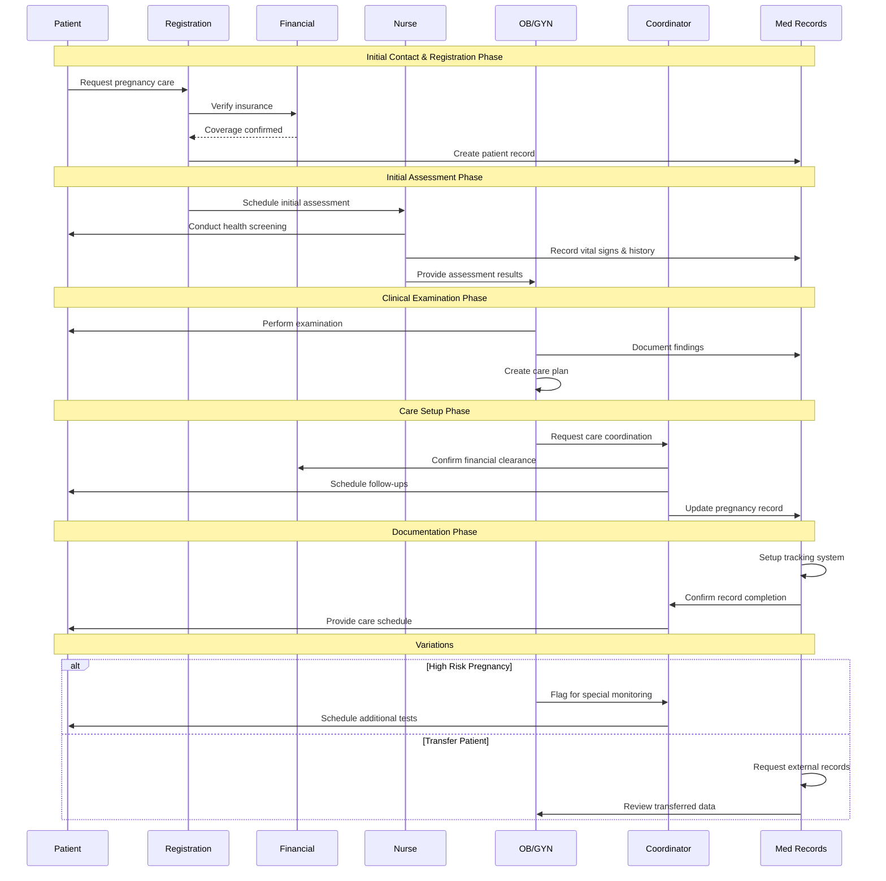

## New Patient Pregnancy Registration and Initial Visit Setup
### This document conventions - an introduction
Each of the sections has the following structure:
```text
WHO (conversation sequence)
```
e.g.
```text
Modeling engineer (3)
```

Means that the following section contains a third prompt given by a Modeling engineer.

Then, the LLM replies are visible under:
```text
Claude (3)
```

Means that the following section contains a third prompt result given by a LLM.
### Modeling engineer (1)
<details>
<summary>Click to see prompt (1)</summary>

```text
Using this framework:
1. Triggering event(s): what initiates the process?
2. Results: what are the results expected by the customer and each other stakeholders?
3. Subprocesses: what are the main (usually 5 +/- 2) stages comprising the process?
4. Cases: what are the major variations of the work item that lead to different flows?
5. Participating organizations: who participates, at the level of major internal or external functions or organizations?
6. Invidiual actors (roles) and resposibilities: who are the individual performers (and what roles do they play) and what are the main steps they carry out in the process?

Describe one of the main business processes in this area of business
```

</details>

### Claude (1)
<details>
<summary>Click to see prompt result (1)</summary>

```text
Let's analyze the "New Patient Pregnancy Registration and Initial Visit Setup" process:

Triggering Event(s):


Patient confirms pregnancy and contacts clinic for first prenatal visit
Referral from primary care physician
Transfer from another healthcare provider
Emergency registration due to pregnancy complications


Expected Results:
For Patient:


Confirmed first prenatal appointment
Initial pregnancy care plan
Understanding of care schedule

For Healthcare Provider:

Complete patient medical history
Pregnancy risk assessment
Initial care plan established
Insurance/payment verification

For Administrative Staff:

Complete registration in system
Insurance verification
Scheduled follow-up appointments
Required documentation collected


Subprocesses:
a) Patient Registration & History Collection
b) Insurance Verification & Financial Clearance
c) Initial Clinical Assessment
d) Care Plan Development
e) Appointment Schedule Creation
f) Documentation & Record Setup
Cases (Variations):


Regular Low-Risk Pregnancy
High-Risk Pregnancy
Transfer from Another Provider
Late Pregnancy Registration (>20 weeks)
Emergency Registration
International/Out-of-State Patient


Participating Organizations:
Internal:


Registration Department
Clinical Assessment Team
Financial Services
Medical Records
Prenatal Care Department

External:

Insurance Companies
Previous Healthcare Providers
Primary Care Physicians
Laboratory Services
Ultrasound Services


Individual Actors & Responsibilities:

Registration Staff:

Collect patient information
Create system records
Verify insurance
Schedule initial appointments

Nurse:

Initial health assessment
Vital signs collection
Medical history review
Risk screening

OB/GYN:

Clinical examination
Risk assessment
Care plan creation
Order initial tests

Financial Counselor:

Insurance verification
Payment plan setup
Cost estimation
Financial counseling

Care Coordinator:

Schedule follow-up appointments
Coordinate with external providers
Arrange additional services
Patient education scheduling

Medical Records Staff:

Create pregnancy record
Import external records
Setup documentation tracking
Ensure compliance requirements

This business process demonstrates the complexity and interconnected nature of pregnancy care initiation, involving multiple contexts and requiring careful coordination between different departments and roles.
```


</details>


### Modeling engineer (2)
```text
Visualize those processes using sequence diagram
```
### Claude (2)

