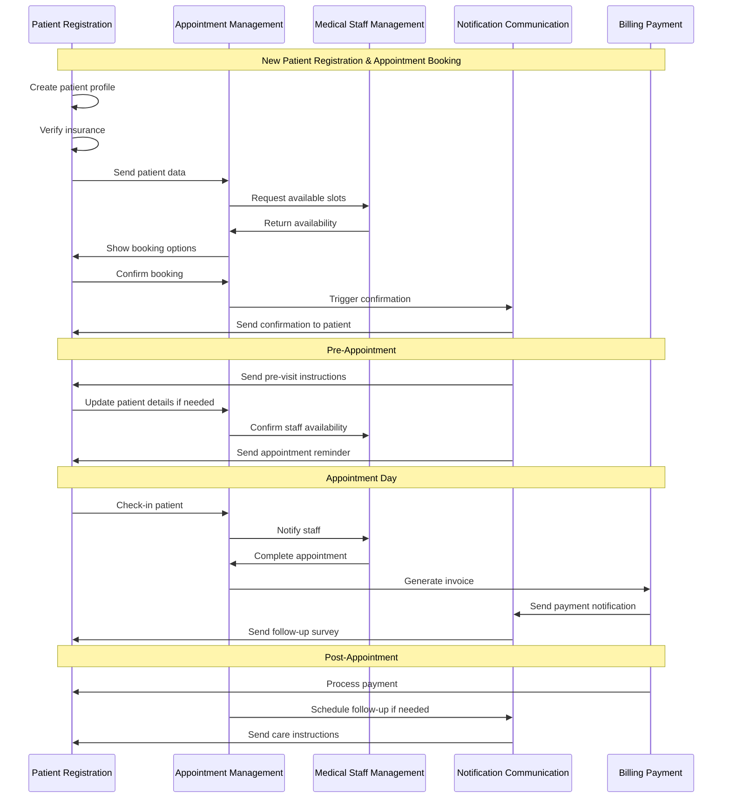

```mermaid
sequenceDiagram
    participant PR as Patient Registration
    participant AM as Appointment Management
    participant MSM as Medical Staff Management
    participant NC as Notification Communication
    participant BP as Billing Payment

    Note over PR,BP: New Patient Registration & Appointment Booking
    PR->>PR: Create patient profile
    PR->>PR: Verify insurance
    PR->>AM: Send patient data
    AM->>MSM: Request available slots
    MSM->>AM: Return availability
    AM->>PR: Show booking options
    PR->>AM: Confirm booking
    AM->>NC: Trigger confirmation
    NC->>PR: Send confirmation to patient

    Note over PR,BP: Pre-Appointment
    NC->>PR: Send pre-visit instructions
    PR->>AM: Update patient details if needed
    AM->>MSM: Confirm staff availability
    NC->>PR: Send appointment reminder

    Note over PR,BP: Appointment Day
    PR->>AM: Check-in patient
    AM->>MSM: Notify staff
    MSM->>AM: Complete appointment
    AM->>BP: Generate invoice
    BP->>NC: Send payment notification
    NC->>PR: Send follow-up survey

    Note over PR,BP: Post-Appointment
    BP->>PR: Process payment
    AM->>NC: Schedule follow-up if needed
    NC->>PR: Send care instructions
```
